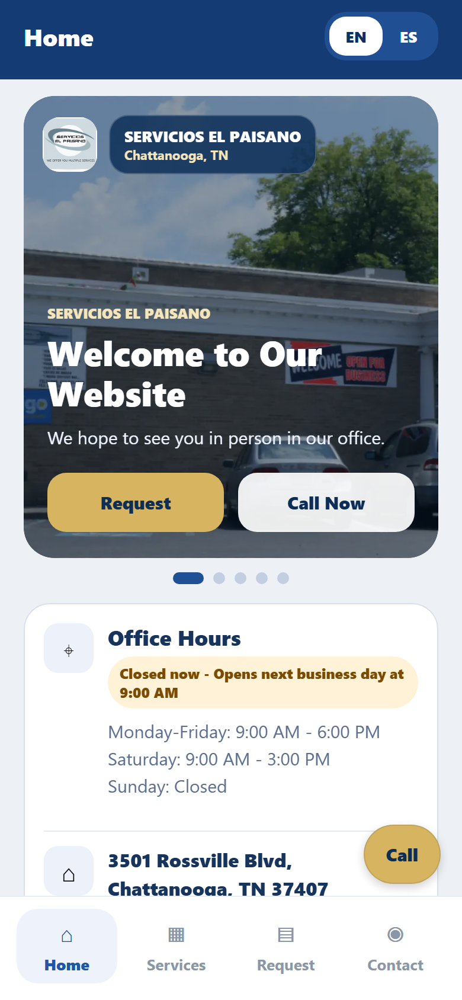
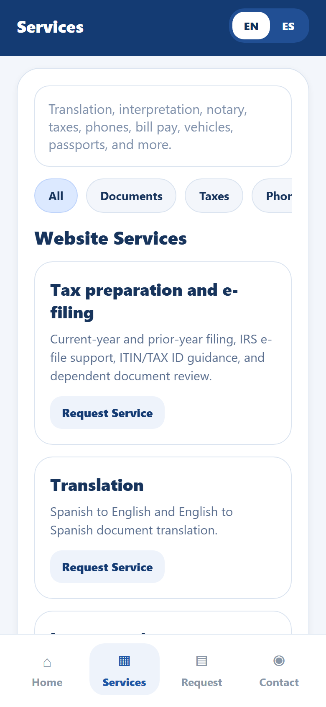
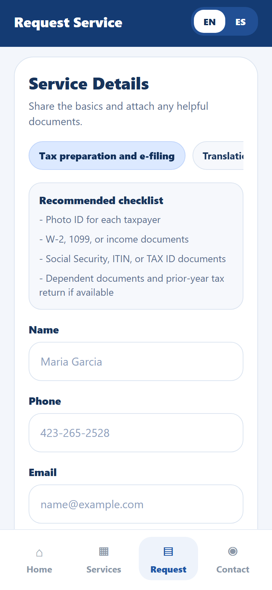
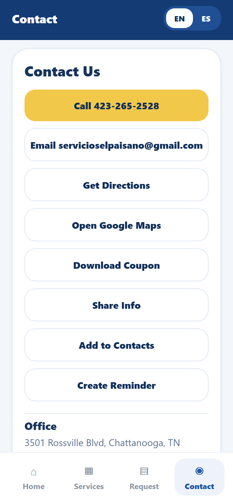
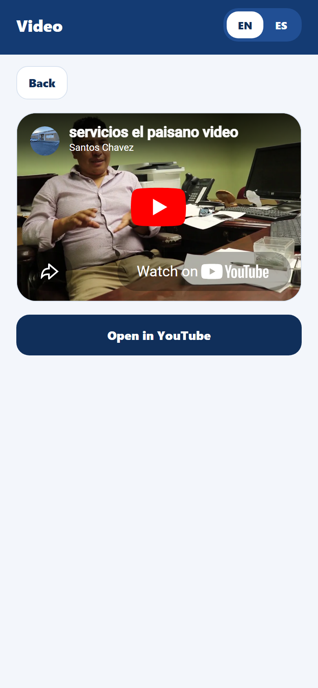

<div align="center">
  

  # Servicios El Paisano

  Bilingual Expo app for community services, document support, tax help, contact actions, offline requests, and live website-backed content.

  <p>
    
    
    
  </p>
</div>

---

## App Preview

| Home | Services | Request |
| --- | --- | --- |
|  |  |  |

| Contact | Video |
| --- | --- |
|  |  |

The app also includes an in-app YouTube screen, request form attachments, saved offline requests, bilingual content, native phone/email/maps actions, and live content refresh from the website.

## Active Project

```bash
npm install
npm run start
```

The active app lives in:

```text
servicios-elpaisano-expo
```

New VS Code terminals are configured to open there automatically, so direct commands like `npx expo start` work without changing folders.

## Root Commands

Run these from the repo root:

```bash
npm run start
npm run start:clear
npm run lint
npm run typecheck
npm run export:web
npm run sync:site
npm run expo -- --version
npm run screenshots
```

## Feature Map

| Area | Status |
| --- | --- |
| Bilingual English/Spanish UI | Implemented |
| Live website-backed content | Implemented via `app-content.json` |
| Service request form | Implemented |
| Camera/photo attachments | Implemented |
| Document picker attachments | Implemented |
| Offline saved requests | Implemented |
| Native phone, email, maps, share | Implemented |
| In-app YouTube video | Implemented with `react-native-webview` |
| Expo Go notification guard | Implemented |
| Archived web wrapper | Moved to `archive/frontend-next-wrapper` |

## Live Content

The app reads live content from:

```text
https://servicioselpaisano.com/app-content.json
```

The phone app uses this order:

1. Bundled fallback content.
2. Cached server content.
3. Fresh server content.

See:

```text
servicios-elpaisano-expo/docs/live-content.md
```

## Project Layout

```text
.
├── servicios-elpaisano-expo/      # Active Expo native app
├── archive/frontend-next-wrapper/ # Archived Next.js/Capacitor wrapper
├── docs/                          # Project docs
│   └── screenshots/               # README app screenshots
├── scripts/                       # Legacy/root helper scripts
└── package.json                   # Root command shortcuts into Expo
```

## Screenshots

Regenerate the README screenshots after meaningful UI changes:

```bash
npm run export:web
npm run screenshots
```

The screenshot script serves the Expo web export locally and captures mobile-sized
screens with Playwright.

## Archived Project

The previous Next.js/Capacitor web wrapper is retained for reference only:

```text
archive/frontend-next-wrapper
```

Do not use it for active app development unless the project direction changes back to a web wrapper.

## Notes

- Keep native WebView code inside the Expo app.
- Keep live content public and non-secret.
- Use `npm run start:clear` if Metro keeps stale cached app content during development.
